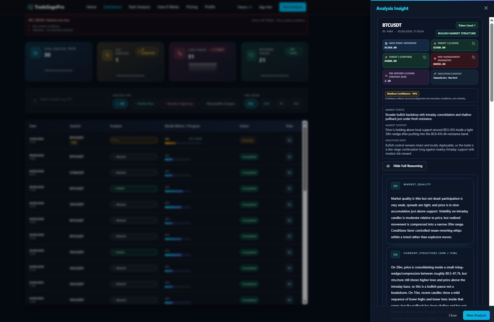
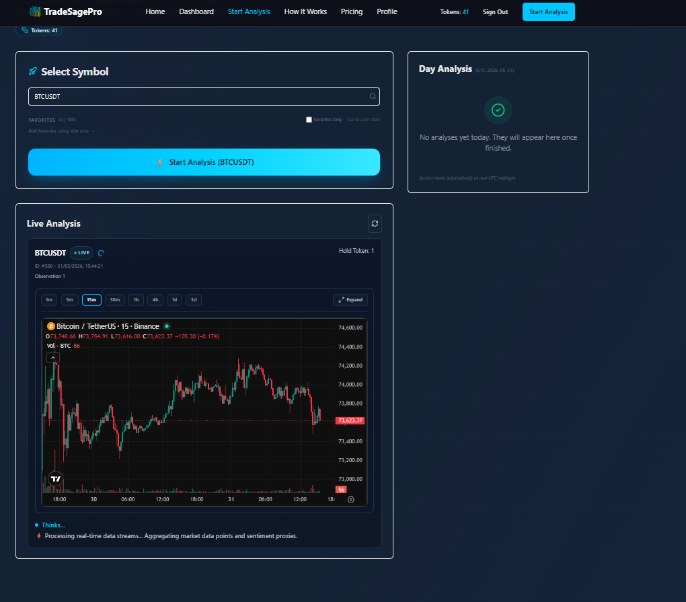
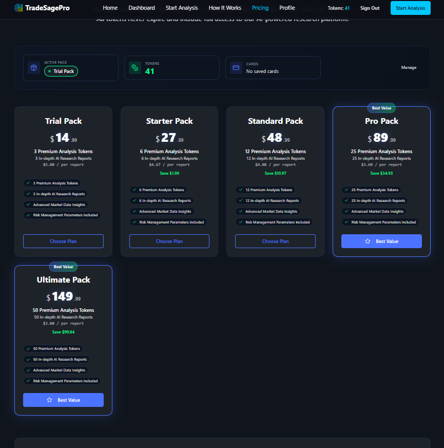
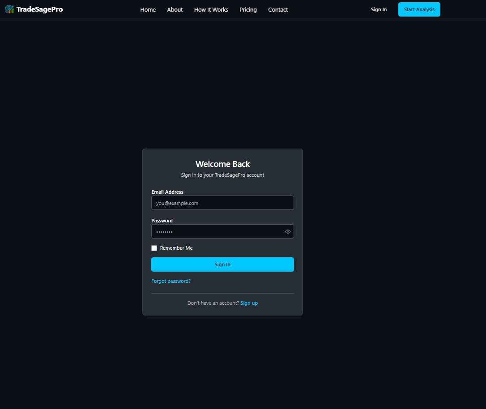

# TradeSagePro

Cloud-native SaaS platform for market analysis, automation, and decision-support workflows.

🌐 Website: https://tradesagepro.com

---

## Overview

TradeSagePro is a modern SaaS platform designed to process market data, manage user accounts, execute structured analysis workflows, and present results through an intuitive web dashboard.

The platform combines scalable backend services, modern frontend technologies, cloud infrastructure, and real-time data processing to deliver a seamless user experience.

This repository serves as a public showcase of the product and does not contain proprietary source code.

---

## Core Features

### User Platform

* Secure user authentication and account management
* Dashboard with analysis history and statistics
* Credit-based usage system
* Subscription and pricing management
* Responsive web experience

### Analysis System

* Structured market analysis workflows
* Real-time data processing
* Multi-stage evaluation pipeline
* Insight generation and reporting
* Detailed analysis result pages

### Administration

* Administrative dashboard
* User management tools
* Platform monitoring
* System configuration controls
* Business analytics and reporting

### Infrastructure

* Cloud-native architecture
* Scalable backend services
* Secure API ecosystem
* Automated deployment workflows
* Production-ready environment

---

## Technology Stack

### Backend

* Python
* FastAPI
* PostgreSQL
* SQLAlchemy
* REST APIs

### Frontend

* React
* TypeScript
* Tailwind CSS

### Mobile

* React Native

### Infrastructure & DevOps

* Docker
* Google Cloud Platform
* Cloud Run
* Cloud SQL
* GitHub Actions

---

## Product Screenshots

### Dashboard



---

### Analysis Workspace



---

### Pricing & Credit Management



---

### User Authentication



---

## Architecture Overview

```text
User
  │
  ▼
React Frontend
  │
  ▼
FastAPI Backend
  │
  ├── Authentication Services
  ├── Analysis Engine
  ├── User Management
  ├── Admin Services
  └── External Integrations
  │
  ▼
PostgreSQL Database
  │
  ▼
Cloud Infrastructure
```

---

## Business Goals

TradeSagePro is built with a strong focus on:

* Scalability
* Reliability
* Performance
* User Experience
* Cloud-Native Deployment
* Secure Data Management

---

## About

TradeSagePro is developed and maintained by **Jaba Sharadze**, Founder of **JINOVEX LLC**.

The project represents a modern approach to SaaS architecture, combining cloud technologies, scalable infrastructure, and advanced workflow automation.

---

## Company

### JINOVEX LLC

Building SaaS products, cloud-native applications, APIs, and modern software solutions.

📍 Tbilisi, Georgia

🌐 https://tradesagepro.com

---

## Disclaimer

This repository is intended to showcase the product, architecture, and technical direction of the platform.

Source code, proprietary algorithms, business logic, infrastructure configuration, and internal implementation details are not publicly available.
